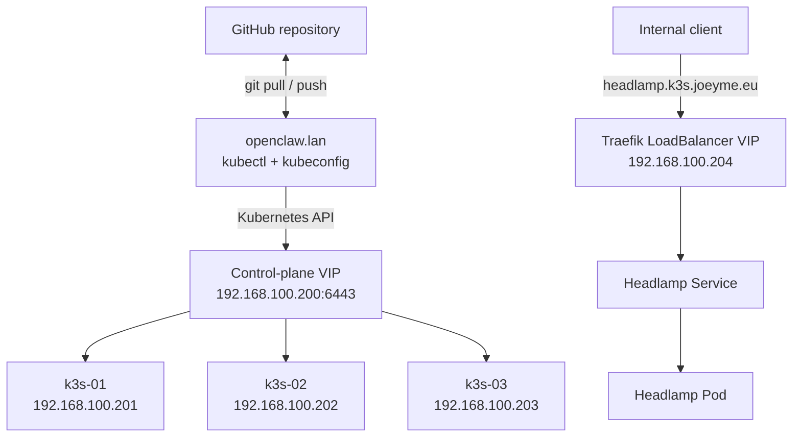

# Three-Node K3s Homelab

This repository documents my hands-on Kubernetes learning environment: a highly available, three-node K3s cluster running an embedded etcd control plane, kube-vip for virtual IPs, Traefik for ingress, and Headlamp as a web-based cluster dashboard.

The manifests are the declarative source for cluster infrastructure and applications. Cluster administration is performed from a separate management host rather than from a K3s node.

## Architecture



All three K3s nodes run:

- The K3s control plane
- Embedded etcd
- Schedulable workloads
- A kube-vip DaemonSet instance

| Component | Purpose | Version in manifests |
| --- | --- | --- |
| K3s | Kubernetes distribution | Cluster runtime version may change independently |
| kube-vip | Control-plane and service virtual IPs | `v1.2.3` |
| kube-vip cloud provider | Allocates LoadBalancer addresses | `v0.0.12` |
| Traefik | Ingress controller | Managed by K3s |
| Headlamp | Kubernetes dashboard | `v0.45.0` |

## Repository layout

```text
.
├── apps
│   └── headlamp
│       ├── headlamp.yaml
│       └── ingress.yaml
└── infrastructure
    └── kube-vip
        ├── address-pool.yaml
        ├── cloud-controller.yaml
        ├── daemonset.yaml
        ├── k3s-config.yaml.example
        └── rbac.yaml
```

## Design decisions

### Highly available control plane

The Kubernetes API is reached through `192.168.100.200`, not through an individual node. kube-vip advertises this address and moves it between control-plane nodes when leadership changes.

### LoadBalancer services

The built-in K3s ServiceLB is disabled. kube-vip allocates addresses for Kubernetes services of type `LoadBalancer`; the current pool contains `192.168.100.204`, which is assigned to Traefik.

### Separate management host

Git, `kubectl`, and the administrative kubeconfig live on `openclaw.lan`. The K3s nodes contain only the runtime and node-local configuration. This keeps cluster nodes focused on running the cluster and provides one clear Git workflow.

## Deployment

> These manifests describe my lab. Review and adapt the addresses, interface name, hostnames, RBAC, and versions before using them elsewhere.

### 1. Configure each K3s server

`infrastructure/kube-vip/k3s-config.yaml.example` shows the required node-local K3s configuration:

```yaml
tls-san:
  - 192.168.100.200

disable:
  - servicelb
```

This configuration belongs at `/etc/rancher/k3s/config.yaml` on every server. It is an example file rather than an automatically applied Kubernetes manifest because it configures the K3s process itself.

### 2. Deploy kube-vip

```bash
kubectl apply -f infrastructure/kube-vip/rbac.yaml
kubectl apply -f infrastructure/kube-vip/cloud-controller.yaml
kubectl apply -f infrastructure/kube-vip/daemonset.yaml
kubectl apply -f infrastructure/kube-vip/address-pool.yaml
```

### 3. Deploy Headlamp

```bash
kubectl apply -f apps/headlamp/headlamp.yaml
kubectl apply -f apps/headlamp/ingress.yaml
```

Headlamp is available internally at:

```text
https://headlamp.k3s.joeyme.eu
```

## Validation

Useful checks after a deployment or change:

```bash
kubectl get nodes
kubectl -n kube-system get daemonset kube-vip-ds
kubectl -n kube-system get service traefik
kubectl -n headlamp get deployment,pod,service,ingress -o wide
```

Before applying a manifest, I use server-side validation and inspect the live difference:

```bash
kubectl apply --dry-run=server -f apps/headlamp/headlamp.yaml
kubectl diff -f apps/headlamp/headlamp.yaml
```

## Availability test

I tested workload rescheduling by cordoning `k3s-01` and `k3s-03`, deleting the running Headlamp pod, and watching Kubernetes recreate it on `k3s-02`. Headlamp remained reachable through Traefik's `192.168.100.204` LoadBalancer address. Both nodes were uncordoned after the test.

This demonstrated the difference between:

- A stable service endpoint
- A replaceable pod
- Kubernetes scheduling
- Ingress routing
- Control-plane and workload availability

## Security notes

- Kubeconfigs, private keys, environment files, and secret manifests are excluded by `.gitignore` and must never be committed.
- No service-account tokens or other credentials are stored in this repository.
- The `headlamp-admin` service account is intentionally bound to `cluster-admin` for this personal, access-restricted learning lab. Its token is generated only when needed and is not stored in Git. A production deployment should use least-privilege RBAC and an appropriate authentication method.
- Private RFC1918 addresses shown here document the lab topology and are not Internet-routable.

## Lessons learned

- A Kubernetes namespace deletion does not remove cluster-scoped resources such as a `ClusterRoleBinding`.
- A LoadBalancer VIP and the Service status are related but separate states; both should be verified while troubleshooting.
- Cordoning a node prevents new scheduling but does not move existing pods automatically.
- Git history is useful only when credentials remain outside the repository from the beginning.
- Keeping the management tooling off the cluster nodes makes ownership and recovery clearer.

This is an active learning repository. The configuration will evolve as I add workloads and improve the cluster design.
